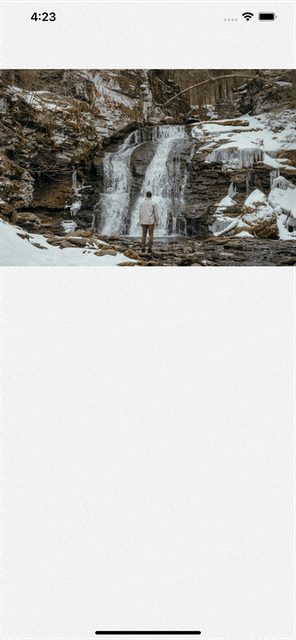

# react-native-collage-layout

An easy-to-use collage layout component for rendering network images.

```sh
yarn add react-native-collage-layout
```

## Usage

### Simple examples

| One Image                                          | `Two Images`                                               | `Three Images`                                |
| ---------------------------------------------- | -------------------------------------------------------------- | ------------------------------------------------------------------ |
|  |  |  |

This component is similar to how Facebook shows images in post.

```javascript
import React from 'react';
import { StyleSheet } from 'react-native';
import CollageLayout from 'react-native-collage-layout';

const images = [
  {
    uri : "https://images.unsplash.com/photo-1678219718773-db0186c9ce63?ixlib=rb-4.0.3&ixid=MnwxMjA3fDB8MHxwaG90by1wYWdlfHx8fGVufDB8fHx8&auto=format&fit=crop&w=1170&q=80",
    aspectRatio : 1.5,
  },
];

export default class App extends React.Component {
  render() {
    return (
        <View>
            <CollageLayout
                spacing={2}
                images={photos}
            />
        </View>
    )
  }
}
```

<!-- Here a custom `renderItem` is supplied and the `bottomButton`-props has been set to `true`. Notice how the setup of `slides` has been configured to support icons and gradient backgrounds.
 -->
## Props and methods

The component extends `FlatList` so all FlatList-props are valid.

### Props

| Name             | Type       | Default                                      | Description                                                                    |
| ---------------- | ---------- | -------------------------------------------- | ------------------------------------------------------------------------------ |
| images           | `object`   | None, required                               | An array of objects. Each object should contain `uri` and `aspectRatio` keys   |
| onTapImage       | `function` | `void`                                       | Called when user taps on any image. Function returns image `index`             |
| spacing          | `number`   | 1.5                                          | Spacing amount between images                                                  |
| layoutMinHeight  | `number`   | 23% of Screen                                | Minimum allowed height for layout                                              |
| layoutMaxHeight  | `number`   | 70% of Screen                                | Maximum allowed height for layout                                              |
